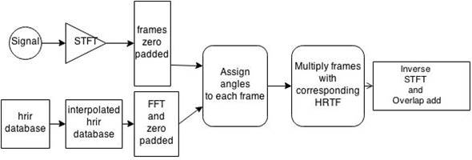
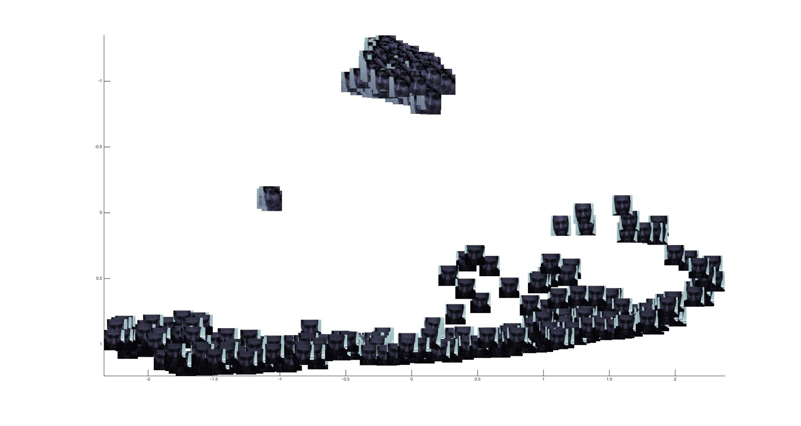
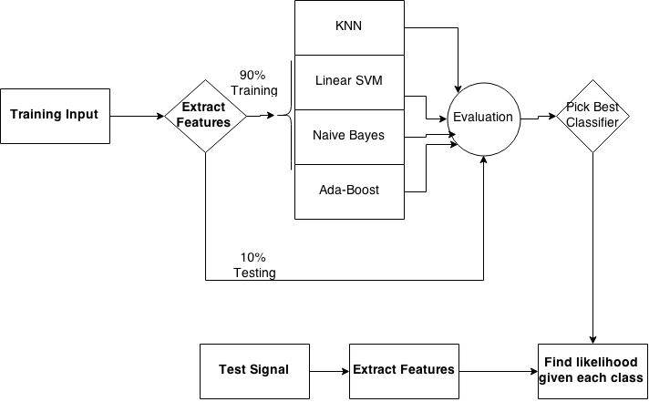

Introduction
============

Spatial audio and speaker classifications both have important
applications in video conferencing and entertainment. With spatial
audio, one can listen to music and feel the depth and the directionality
of the sound using headphones or crosstalk canceller speakers [1].
Imagine hearing a tank approaching you from the living room when playing
high-end resolution video games. 3D audio is yet to be able achieve
these ambitious goals, though it can still create a more realistic sound
fields than surround sound. 3D audio is normally recorded through
binaural microphones mounted on a Kemar [2]. One can also reconstruct 3D
audio using Head Related Transfer Function by forming beams at every
direction using microphone arrays [3]. These techniques require precise
calibration and are not very accurate in real environments due to noise
and reverberation. Most importantly, if a video was not recorded using
microphone arrays or binaural microphones, it is too difficult, if not
impossible, to recover spatial audio. That is why we propose a method by
using the contents in the video, the visual cues, to help reconstruct
3D audio.

The other goal of this project is to perform multimodal speaker
recognition using facial and speech likelihoods by first learning
different features from a training video using a user friendly
calibration procedure discussed in this paper. In section 2, we talk
about the general flow of the algorithm for reconstructing 3D audio and
speaker recognition algorithms. In section 3, face detection,
classification, and tracking are discussed in detail. Then, in section 4,
voice activity detection (VAD) and speech classification algorithms are
explained thoroughly. Next in section 5, we shall go over the results for 3D audio
reconstruction and multimodal speaker recognition. And finally, in
section 4, we suggest future possibilities for our project in other
systems and applications.

General Flow
============

In this section, the basic procedure for reconstructing 3D audio and
multimodal speaker recognition are discussed.

3D Audio Reconstruction
-----------------------

One can reconstruct the 3D audio by convolving a mono sound with
the spatial response corresponding to a desired location in space. These
impulse responses can be captured by recording a maximum length sequence
(MLS) at listener’s ears at different angles. We can then extract
corresponding impulse responses by cross-correlating the recorded MLS
with the original MLS as shown in (@1) (@2) (@3). These spatial responses
are also called Head Related Impulse Response (hrir).

> (@1) $index = argmax({C_{(MLS_{recorded},MLS_{original})}})$
>
> (@2) $hrir_i = C_{(MLS_{recorded},MLS_{original})}(i-L:i+L)$
>
> (@3) $3D_{audio} = signal_{mono} * hrir$

, where $L$ is half the impulse response desired length. This number is
usually about 128 samples, but it can differ based on the recording
room, e.g. such the early reflection sample index and $C_{xy}$
represents the cross-correlation between $x$ and $y$. In this project we
used MIT HRTF database for reconstructing spatial audio [4].

To avoid clicking sounds when reconstructing 3D audio and with the added 
benefit of simplicity, we reconstruct the signal in frequency domain. In short,
one must first find the short time Fourier transform of the signal and
then multiplied that by the desired zero-padded HRTF and take inverse
STFT to recover the time domain signal back, as shown in figure 1.

Here, we have made the following assumptions:[^4]

1. This algorithm is only able to spatialize speech based on a
speaker’s face.
2. There are at most two speakers in the video.
3. At least one of the two speakers in the room is in the training
database.
4. There are no sudden movements in the video stream.

Note the relaxing of these assumptions is discussed in section 4.
For training purposes, we recorded a video clip of two
people sitting on left and right of a video frame having a conversation,
as shown in figure 2. With the video, we demonstrate a calibration procedure
detailed below.

\begin{figure}[htb]
\begin{minipage}[b]{0.88\linewidth}
\centering
\centerline{\includegraphics[width=8.0cm]{imgs/faraz_marcell.jpg}}
\centerline{}
\centerline{\includegraphics[width=6.0cm]{imgs/part1.png}}
\centerline{}
\centerline{\includegraphics[width=6.0cm]{imgs/part4.png}}
\centerline{}
\centerline{\includegraphics[width=6.0cm]{imgs/part3.png}}
\end{minipage}
\caption{Recording of two people having a conversation followed by a depiction of 3D audio and speaker recognition}
\label{fig:res}
\end{figure}

## Calibration ##

The calibration procedure is as follows,

First there is a required silence period for calibrating the Voice 
Activity Detection discussed later. Then each user is asked in turn to:

1. Clap hands and wave to the camera.
2. Speak for about a minute while facing the camera.

This is repeated until all users have spoken. Note then, that
the labels correspond to the order that speakers clapped.

The procedure is summarized in figure 3.

\begin{figure}[htb]
\begin{minipage}[b]{0.98\linewidth}
\centering
\centerline{\includegraphics[width=9.0cm]{imgs/calib1.png}}
\end{minipage}
\caption{Calibration}
\label{fig:res}
\end{figure}
\centerline{}

The system will require re-calibration if/when the lighting
and the background sound is different for both 3D audio
reconstruction and speaker recognition.

After collecting a training database, the classifier 
discussed in section 3 and 4 is created.

3D Audio Reconstruction
-----------------------

The procedure for reconstructing 3D audio is as follows:

1. Detect faces in the video stream for each frame and classify them to
one in the database.

2. Map the position of each face to a meaningful HRTF angle in each
frame.

3. Detect whether there is speech in a frame or not.

4. Label the frames with speech from step 4 with their corresponding
class label in the database.

5. Use speech classification results to assign the speech from step 4 to
the point find from step 2. That is, given a speech signal, find
corresponding face location.

6. Pick corresponding HRTFs from step 5 for each frame.

7. Reconstruct 3D audio as shown in figure 1.

Speaker Recognition
-------------------

Now let us consider speaker classification. Our goal is to augment
the face classification using audio cues. Specifically, in the absence
of a speaker, the recognition system should bias towards the
facial classifier. Alternatively, if the speaker’s face cannot be
detected, then the classification algorithm should bias towards speech
classifier. To obtain this behavior we used the following model[9] for the
classification probability.

(@model) $P(user) = P(face|model)^{W_i}P(face \ model) + \ldots \\P(speech|model)^{W_{max}-W_i}P(speech \ model)$

Here the prior probabilities in (@model) are assumed to be equally
probable, although in practice they can/should be estimated based on
prior data and the recording conditions.

Steps 1 through 4 in *3D Audio Reconstruction* are also performed when doing
speaker recognition. After obtaining the training databases for faces and speech,
we do the following,

## Multimodal Speaker Recognition ##

1. Find the likelihood of each user’s face given the face model in each
frame analysis.
2. Find the likelihood of each user’s speech given the speech model in
each frame analysis.
3. Determine the value of (@model) for $w=1, 2..., 10$.
4. Find $w = argmax_w(P(user))$.

Higher $w$’s shows that the face classification results was better than
speech classification results, and so we should put more weight on the
facial classifier. This could be due to the quality of the training set,
or just the fact that the face classifier works better than the speech
classifier. As an example, one way of choosing $w$ is measure the SNR of
the signal, and put more weight on the speech classifier when the SNR is
higher. With figure 4 summarizing the general flow of this project, we
conclude section 2.

FACE DETECTION, CLASSIFICATION AND TRACKING
===========================================

In this section, we discuss the details of detecting faces in a video
stream, training facial features, and tracking faces throughout the
video frames.

Face Detection
--------------

The first step in detecting faces is prepossessing every frame. In most
image processing application, prepossessing is done to assure better
quality results. For this project the prepossessing steps are as
follows,

1. Resize the video frames to smaller dimensions so we can detect
faces faster.
2. Map the RGB color to gray colormap to simplify the computation.
3. Apply histogram equalization to each frame to make sure the contrast
is evenly spread out throughout the whole pixels.

We then setup Matlab’s vision library for face detection [5]. Since some
detected faces are going to be small, we defined a threshold that would
disregard any faces smaller than a certain number of pixels. This would
create a precise training database. We then resize and vectorised all
detected faces into a matrix for each user (face database). This is
summarized in figure 5.

\begin{figure}[htb]
\begin{minipage}[b]{0.88\linewidth}
\centering
\centerline{\includegraphics[width=3.0cm]{imgs/face_detection.jpg}}
\centerline{\includegraphics[width=5.0cm]{imgs/detect1.png}}
\end{minipage}
\caption{Face Detection}
\label{fig:res}
\end{figure}

Note that if there is more than one user in the room, we need to be able
to identify the approximate location of each so we can label them. This
is why we defined the calibration procedure in section 2. We first
attempted to find this location by detecting mouth movement, however,
due to resizing; the resolution was not high enough to detect lips
movement. For simplicity, we ask our users to clap and wave to the
camera, since it is easier to detect a bigger area of a motion. We
simply use frame subtraction to identify the pixels that corresponds to
higher variance. The clap sound detection from previous section will
tell us the approximate frame number for the clap motion in the video,
so the area of search is only a few frames.

> (@5) $sub_{frame} = (frame_i - mean(frame_{1:i-1}))^2$
>
> (@6) $[i_{max}, j_{max}] = max(sub_{i=1:n,j=1:m})$

Where $n$ and $m$ are the number of pixels in the vertical and
horizontal axis. We don’t care for the exact position of those high
variant pixels, we only need an approximation of which part of the frame
that specific user is located at, e.g. left, right, up, down. The
resulting pictures for frame subtraction, division and face detection are
shown in figure 6.

\begin{figure}[htb]
\begin{minipage}[b]{0.88\linewidth}
\centerline{\includegraphics[width=5.60cm]{imgs/clap_motion.jpg}}
\centerline{\includegraphics[width=6.60cm]{imgs/3d_audio_tracking_1.jpg}}
\centerline{\includegraphics[width=3.0cm]{imgs/3d_audio_tracking_2.jpg}}
\end{minipage}
\caption{Frame subtraction and division into two partitions for labeling each class}
\label{fig:res}
\end{figure}

Face Classification
-------------------

Now that we have a database of faces for each user, we need to train
each database. We used Gaussian Mixture Models for training the facial
database. Since the dimensions of the training database are fairly
large, we first lower the dimensionality of the database using PCA to 36
and then use a 5 order GMM to fit it to the model. Dimensionality
reduction is also important when training a database with a GMM, since
in high dimensions; GMM might not able to estimate the covariance
matrix. Face training is summarized below.

> (@train) $Train = \{train_{user1}, train_{user2}\}$
> (@pca) $Pt = PCA(train,number\ of\ eigenvector)$
> (@gmm) $Gpt = GMM(pt,dimensions)$

The eigen faces from the PCA is shown in figure 7.

Having the GMM model for each database, one can then easily find the
probability of each face given each model by calculating the log
likelihood of the testing data that is projected to PCA space in
(@pca), given the mean and the variance find in (@gmm). This
is shown in (@10).

> (@10) $f(test|\mu,\sigma) = \frac{1}{test\ \sigma\sqrt{w\pi}}e^\frac{ln(x-\mu)^2}{2\sigma^2}$

In figure 8, the scatter plot each class using the first two highest
eigenvector from the PCA matrix is shown. As you can see, the two classes
are linearly separable, so we should be able to get high accuracy from
our classifier.

We left $10\%$ of our training database for testing and trained the
remaining $90\%$. The result of our facial classifier is tabulated
below.

\begin{center}
\begin{tabular}{ | l|c | r| }
\hline
Class 1 & $95\%$ \\ \hline
Class 2 & $100\%$ \\ \hline
\end{tabular}
\end{center}
\centerline{Table 1: Face Classification Accuracy}

As expected we have high accuracy, since the two classes were shown to
be linearly separable in 2 dimensions.

Face Tracking
-------------

Matlab’s face detection function draws a rectangle around the detected
faces. We extracted the coordinates for that rectangle and use the
center of the rectangle as the position of the detected user. Such
tracking algorithm usually does give good results due to face detection
inaccuracy. Since we do not need to know the exact position of the user
at each frame, we can compensate for this flaw by applying moving
average to the tracking results as well as fitting a polynomial[^3] to it
(in this case a polynomial of order 10 and moving average of 25 frames
length). If the sources were stationary we can use a longer moving
average for smoothing the results. The result of such process is shown
in figure 9.

The $x-axis$ corresponds to the time frame, and the $y-axis$ is the
approximated $x-position$ of the detected face. We only look at things
in the azimuth, since the 3D audio does not sound very good for
elevation angles.

In general, for recreating spatial audio for $n$ people, one requires at least
$n-1$ training databases. Recall in section 2.1 we assumed that we
only have up to 2 users in a video frame. Therefore, if we have the
training dataset for one of the users, we can classify one in the
database with a label and define a threshold for the other user; so we
can label him/her as unknown class. This threshold is defined as
following,

(@11) $P(face|model)<TH$ $\implies Face_{label} : unknown$

The tracking result of the one unknown and one known user case shown
in figure 6 is shown in figure 10.

As you can see, each source is correctly detected at opposite edge of
each video frame. The spikes in these graphs are mainly for two reasons,
1- slight head movement and 2- Face detection errors. As mentioned
earlier, the first problem can be ease out by using moving average and
the second problem by fitting a polynomial to the database as seen in
figure 9. The spectrogram shown in figure 10 is also the tracking
results; we mainly use it since it is clearer when visualizing the
tracking over video frames.

VOICE ACTIVITY DETECTION AND CLASSIFICATION
===========================================

The following are details concerning the procedure used for voice classification.
When developing our models, 10% of the data was separated for testing and the
remaining 90% for training each class. The STFT of the signal uses
non-overlapping rectangular windows corresponding to one frame.
The window size is computed as:

> (@fps) window_size $= \frac{\text{samples}}{\text{seconds}} \cdot \frac{\text{seconds}}{\text{frames}} \cdot (\text{1 frame})$

Frames serve as the base unit here because they are the base unit in the facial analysis, 
allowing for one-to-one comparisons.[^2]
We then project the extracted features to a lower dimensional space using PCA.
This procedure mirrors the technique described in section 3 for training the face databases.

Voice Activity Detection (VAD)
-----------------------------

Voice activity detection enables the filtering of non-speech components 
(usually silence) from speech components. In order to do VAD, we developed
a supervised technique for labeling the speaker classes (the signals between claps)
and non-speech signals (the signals before the first clap). The VAD classification
results for four different classifiers using Log Spectral Coefficients (LSC) or 
Mel Frequency Cepstral Coefficients (MFCC) are listed in table 2.

\begin{center}
\begin{tabular}{ | l|c | r| }
\hline
Classifier & LSC & MFCC \\ \hline
Linear SVM & $99.9\%$ & $99.9\%$ \\ \hline
Gaussian Naive Bayes & $99.9\%$ & $99.9\%$ \\ \hline
20-Nearest Neighbor & $99.9\%$ & $99.9\%$ \\ \hline
\end{tabular}
\end{center}\centerline{Table 2: VAD Accuracy}
\centerline{}

The results from each classifier are nearly perfect. 
This is perhaps expected given the clear linear separability in
figure 11. In fact on inspection, the primary feature is unsurprisingly
dominated by the energy level. Because of the comparable accuracy of each 
classifier, our final implementation uses a linear SVM due to its simplicity 
and speed.

Voice Classification
--------------------

The procedure for classifying speech is summarized in figure 12. The resulting
classification results are given in table 3.
In addition, the corresponding LCS and MFCC features are shown for a 2 dimensional
space in figure 11 for non-speech signals, class 1 and class 2 speech
signals. Non-speech and speech classes are clearly separable; however,
the separability of the speech classes remains suspect. Nevertheless, 
given the empirical success of the classifiers, the speech classes appear
to be separable in higher dimensions. Note that in our tests Ada-Boost had the highest
classification accuracy. Our suspicion is that the other classifiers
make Gaussian assumptions either explicitly or implicitly in the euclidean distance
measures. Ada Boost avoids this fate by using a collection of classifiers, that
while potentially making individual Gaussian assumptions, are not necessarily Gaussian 
distributed themselves.

\begin{center}
\begin{tabular}{ | l|c | r| }
\hline
Classifier & LSC & MFCC \\ \hline
Linear SVM & $83.0\%$ & $85.3\%$ \\ \hline
Gaussian Naive Bayes & $82.4\%$ & $80.2\%$ \\ \hline
20-Nearest Neighbor & $84.9\%$ & $86.7\%$ \\ \hline
Ada-Boost & $91.2\%$ & $90.3\%$ \\ \hline
GMM & $83.5\%$ & $---$\\ \hline
\end{tabular}
\end{center}\centerline{Table 3: Voice Classification Accuracy}

\begin{figure}[htb]
\begin{minipage}[b]{0.88\linewidth}
\centerline{\includegraphics[width=6.6cm]{imgs/mfcc_2pca.png}}
\centerline{\includegraphics[width=6.6cm]{imgs/spectral_log_2pca.png}}
\end{minipage}
\caption{MFCC (top) and LSC features (bottom) for three classes}
\label{fig:res}
\end{figure}

Now that we have our VAD and speech classifiers, we can easily assign
labels to every analysis frames, e.g. no speech, class 1, class 1, class
2, etc. The labels then allow selecting which face rectangle is active, yielding
the location of each user at each frame from section 3 results. We then 
reconstruct spatial audio using the techniques explained in section 2.1.

Results
=======

We recorded a few video clips for which we attempted to reconstruct 3D
audio from, the link is provided in [6]. For the first case, we simply
tracked one person in a video frame, mapped his face location to HRTF
angles and then reconstruct spatial audio using corresponding HRTF
angles from the single channel audio input as was shown in figure 1. The
resulting video named *gobble\_cs598.mp4* can be found in [6]. For
 the second video, we recorded two speakers speaking, a snapshot was
 provided earlier in figure 2. We trained both
speakers’ facial and speech features beforehand as was discussed earlier
in section 3 and 4 and use that to find the face location. At every
frame we detect and capture both speech and faces. Note that given our
face model we already know where speakers are located at, so we simply
classify each audio frame to one of three classes discussed in section
4. We can then create a spatial sound for the two users.

We use the same video with two speakers from last time, to perform
multimodal speaker recognition. This enables the calculation of the 
recognition probabilities in (@model). Note however, we did not try to
estimate $w's$ from the environment. Rather, the values used range from $1$ to $10$ 
for $w$’s, where $1$ put more focus on the face classifier and 10, more weight on the
speech classifier. We then evaluate the $P(user)_{k=1}^K$ over all video
frames for all 10 values of $w$. We can then create a matrix of
likelihoods as the one shown below.

> (@12) $\begin{aligned}
> P(user) = \begin{bmatrix}
> p_{1,1}&\dots& p_{1,w_{\text{max}}}\\
> \vdots &\ddots &\vdots\\
> p_{k,1}&\dots&p_{k,w_{\text{max}}}
> \end{bmatrix}\end{aligned}$

We then look for a value of $w$ that maximizes the user classification
at most frames, that is,

> (@13) $w_{max} = argmax_w(P(user)_{k=1}^K \&_ {w=1}^{10})$

where $K$ is the number of frames. For our video, it turned out that the
value of $w$ is $4$. This means that the multimodal classifier is
putting more weight on the face classifier. This makes sense since the
face classifier was able to achieve higher accuracy than the speech
classifier.

FUTURE WORK
===========

In general we were able to recreate a sound that was guided by speaker’s
face. We also included some example video clips where a piece of music
was guided by the users face. This technology can be specifically useful
in hearing aids. 

Imagine wearing Google Glass. You can capture faces
using the glass and capture speech using your hearing aid. We can do
tracking and classification either on the glass, offline or on the cloud
and then feed the resulting information to the hearing aid to form beams
toward the desired sound source and undo artifacts such as noise and
reverberation in the room.

One of the assumptions made in section 2 was that speakers do not talk
at the same time. One can then apply source separation techniques [7] on
the input signals first based on the number of speakers in the room, and
then follow the same procedure on section 4 to classify each speaker
into their corresponding classes while separating each source.

Another future enhancement is the ability to spatialize sounds other
than speech in a desired video clip. A simple, but exhaustive way of
doing this is to learn features for different objects and sounds as
well. This will also require an even more exhaustive search of detecting
and recognizing objects in defined blocks for every video frames. This
work, however, could be useful for entertainment application, such as in
movies and video games. Based on the key objects in the movie, one can
learn a big database of sounds they make and their shape, and then
reconstruct 3D audio throughout the whole clip, which might take hours
or even days.

One can also use this project and apply it to teleconferencing
applications as well. If you have a room full of stationary speakers,
you can easily learn their facial and speech features by recording one
of the sessions. One can then use the tracking procedure discussed in
section 3 to locate each speaker and use the techniques explained in
section 4 to label the signal as well. That way if the conference room
is equipped with microphone arrays, one can use this information to form
the beam at the current speaker to enhance speech intelligibility. Note
that in teleconferencing, we need to be able to do this in real time.
There are assumptions that we can make to speed things up. For example,
users are probably not moving around the room, so one only needs to
locate them one time. After that, we only need to speech classification
and labeling the signal where even assumption can be made given the
application to simplify and speech up the process for real-time
scenarios.

There are other possibilities for the future of this project. For
example, is it possible to learn a relationship between speech and
facial features using unsupervised methods? Earlier in figure 8 and 11
we depicted the facial and speech features for two and three classes
respectively. We can use clustering methods to classify each group of
features together, e.g. K-Means, GMM clustering or even better time
series clustering such as Hidden Markov Models (HMM). One obvious
disadvantages of clustering is obviously not having access to the labels
of each class. For both 3D audio and speaker recognition, we need to
have labels at each frame of analysis, e.g. given my speech signal,
where is the user? Or given the speech and face likelihoods, who is the
most likely speaker? We think there might be a relationship between
facial features and its corresponding speech features at every frame. If
such correlation exists between the two, one can find one’s face just by
analyzing the speech signals.

One last application that we can think of is to be able to perform
supervised source separation. Since we already have a dictionary of
Eigen faces and speeches for every user, we can simply scan the whole
video frames and signals to extract one's face and speech by finding the
best match between the signals and the corresponding Eigen values. This
idea of unconstrained source separation has already been extensively
investigated on video content analysis and sound recognition in [8].

[^2]: The classification tool also supports averaging over a number of frames.

[^3]: Functionally equivalent to a low pass filter

[^4]: Mostly to keep the project tractable given the time frame
